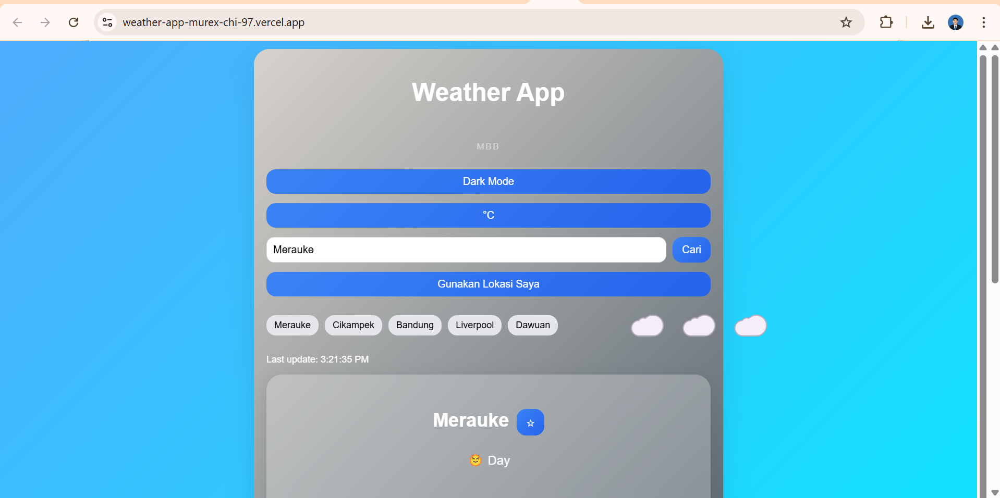
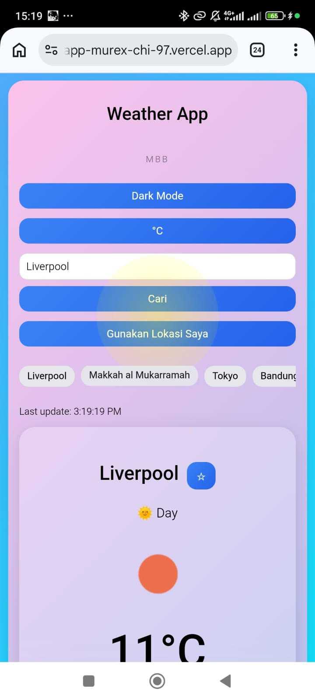

# Weather App

A modern and responsive weather application built with React.
This app provides real-time weather data, 5-day forecasts, and a clean user experience with dynamic UI.

---

## Live Demo

https://weather-app-murex-chi-97.vercel.app/

---

## Features

* Search weather by city
* Auto-detect current location
* Temperature unit toggle (°C / °F)
* Favorite cities
* Search history (max 5 cities)
* 5-day weather forecast
* Automatic day / night mode
* Dynamic background based on weather
* Smooth animations & transitions
* Fully responsive (mobile & desktop)

---

## Tech Stack

* React (Vite)
* CSS (Custom styling)
* OpenWeather API
* Vercel (Deployment)

---

## Project Structure

```
src/
│
├── components/
│   ├── WeatherCard.jsx
│   └── Forecast.jsx
│
├── hooks/
│   └── useWeather.js
│
├── styles/
│   └── styles.css
│
└── App.jsx
```

---

## Installation

1. Clone the repository

```
git clone https://github.com/barikbahari/weather-app/
```

2. Install dependencies

```
npm install
```

3. Create `.env` file

```
VITE_API_KEY=your_api_key_here
```

4. Run the app

```
npm run dev
```

---

## Screenshots

### Desktop



### Mobile



---

## Key Highlights

* Clean separation using custom React hooks (`useWeather`)
* Optimized UX with smooth scrolling & animations
* Persistent data using localStorage
* Dynamic UI based on real-time weather conditions

---

## Future Improvements

* Air quality index integration
* Weather alerts
* PWA support (offline mode)
* Multi-language support

---

## Author

Mohamad Barik Bahari
IoT Engineer | Frontend Enthusiast

---
